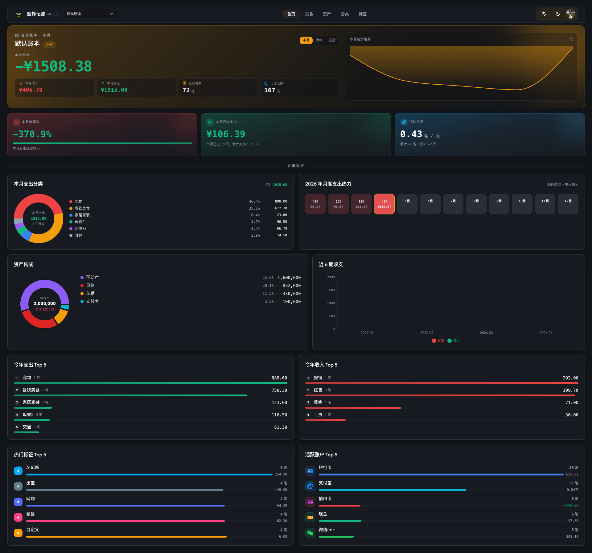

# BeeCount Cloud

[](https://hub.docker.com/r/sunxiao0721/beecount-cloud)
[](./LICENSE)

**Self-hosted sync cloud for the [BeeCount](https://github.com/TNT-Likely/BeeCount) personal accounting app.** Keep iOS / Android / Web books on one ledger you fully own — no ads, no subscription, no third-party lock-in.

🌐 **Language**: [中文](./README.md) | [English](./README.en.md)


---

## ✨ Features

### Core sync
- **Two-way realtime sync** — mobile / web changes land on other devices within ~2 seconds via WebSocket
- **Offline-first** — mobile app writes locally, reconciles on reconnect; conflicts resolved by deterministic Last-Write-Wins with device tie-break
- **Entity-level diff** — transactions / accounts / categories / tags / budgets each tracked individually, no full-snapshot overwrites
- **Auto session recovery** — token refresh failures auto-retry with stored credentials; devices stay online across network hiccups
- **Deep health check** — pull-to-refresh compares local vs remote counts and self-repairs differences

### Bookkeeping
- **Multi-ledger** with per-ledger currency
- **Transactions** — income / expense / transfer, multiple accounts, categories, tags, attachments
- **Budgets** — per-category or total, monthly / yearly period
- **Recurring transactions** (mobile)
- **CSV import / export** (mobile)
- **Rich analytics** — monthly trends, category breakdowns, year heatmap, savings rate, top tags / accounts

### Appearance & preferences (synced)
- Theme color, income/expense color scheme, avatar, display name
- Month display format, compact amount, transaction time visibility
- AI provider configs + custom prompts (mobile AI integration)

### Web console
- Full bookkeeping UI (transactions / accounts / categories / tags)
- Interactive dashboard (mobile-like, responsive)
- Trilingual — 简体中文 / 繁體中文 / English
- Dark / light mode with personalized primary color
- Admin panel — devices, health, sync errors, backup artifacts, **live server logs**

### Admin & ops
- In-memory ring buffer log viewer (level / source / keyword filter + auto-refresh)
- Device session list, online indicator, forced signout
- Backup snapshot create / restore
- `/metrics` Prometheus endpoint, `/ready` health probe

---

## 📸 Screenshots

| English UI | 中文 UI |
|------------|---------|
|  |  |

---

## 🚀 Deploy with Docker Compose

The prebuilt image [`sunxiao0721/beecount-cloud`](https://hub.docker.com/r/sunxiao0721/beecount-cloud) bundles the FastAPI backend + built Web console — single container, mount one data volume, done.

### 1) Create `docker-compose.yml`

```yaml
services:
  beecount-cloud:
    image: sunxiao0721/beecount-cloud:latest
    restart: unless-stopped
    environment:
      DATABASE_URL: sqlite:////data/beecount.db
      # CHANGE THIS — must be 32+ random bytes in production
      JWT_SECRET: change-me-in-production-at-least-32-bytes
      CORS_ORIGINS: http://localhost:8080
      # All data (DB / attachments / backups / avatars) lives under /data
      # so a single volume snapshot captures everything.
      BACKUP_STORAGE_DIR: /data/backups
      ATTACHMENT_STORAGE_DIR: /data/attachments
      ALLOW_APP_RW_SCOPES: "true"
      TZ: Asia/Shanghai
    ports:
      - "8080:8080"
    volumes:
      - beecount_data:/data
    healthcheck:
      test: ["CMD-SHELL", "curl -fsSL http://127.0.0.1:8080/ready || exit 1"]
      interval: 30s
      timeout: 5s
      retries: 5
      start_period: 20s

volumes:
  beecount_data:
```

### 2) Start

```bash
docker compose up -d
```

Open http://localhost:8080 — register the first account (it becomes admin automatically), then configure the mobile app to point at your domain.

### 3) Upgrade

```bash
docker compose pull
docker compose up -d
```

Alembic migrations run automatically on container start (see [Database migrations](#-database-migrations)).

### 4) Backup

The `beecount_data` volume holds everything: SQLite DB, attachments, backup artifacts. Simple volume backup is enough:

```bash
docker run --rm -v beecount_data:/data -v $(pwd):/backup alpine \
  tar czf /backup/beecount-$(date +%F).tar.gz /data
```

### Optional: PostgreSQL

```bash
docker compose -f docker-compose.yml -f docker-compose.postgres.yml up -d
```

---

## ⚙️ Configuration

Most users only need to set `JWT_SECRET` and `CORS_ORIGINS`. Full reference:

| Variable | Default | Description |
|----------|---------|-------------|
| `DATABASE_URL` | `sqlite:////data/beecount.db` | SQLite path or PostgreSQL URL |
| `JWT_SECRET` | *(required)* | JWT signing key, must be 32+ bytes |
| `CORS_ORIGINS` | `http://localhost:8080` | Comma-separated allow-list |
| `ALLOW_APP_RW_SCOPES` | `true` | Leave `true` for mobile app sync |
| `BACKUP_STORAGE_DIR` | `/data/backups` | Backup artifact directory |
| `ATTACHMENT_STORAGE_DIR` | `/data/attachments` | Transaction attachments (avatars stored under `<attachments>/profile-avatars/`) |
| `REGISTRATION_ENABLED` | `false` | Allow new user signup (admins can always create users from the console) |
| `TZ` | `Asia/Shanghai` | Container timezone |

---

## 🗄️ Database migrations

Schema changes are versioned by [Alembic](https://alembic.sqlalchemy.org/).

**On every container start** the entrypoint runs:

```bash
alembic upgrade head && uvicorn server:app --host 0.0.0.0 --port 8080
```

So upgrading the image automatically applies any new migrations sequentially before the service accepts requests. Data persists in the `beecount_data` volume; no manual steps needed for upgrades.

If a migration fails (rare), the container exits and leaves the DB on its previous revision — fix the issue, `docker compose pull && up -d` again.

---

## 📱 Mobile app

Install the [BeeCount](https://github.com/TNT-Likely/BeeCount) app (iOS / Android), then in the app:

1. Settings → Cloud service → BeeCount Cloud
2. Fill in your server URL (e.g. `https://your-domain.com`) and login credentials
3. Enable sync — existing local data is pushed to the cloud on first sync

---

## 🛠️ Development

<details>
<summary>Click to expand development setup</summary>

### Requirements
- Python `3.11+`
- Node `20+`, pnpm `9+`

### First-time setup

```bash
make setup-backend
pnpm -C frontend install
```

### Run locally

```bash
# Terminal 1 — API (port 8080)
make migrate
make dev-api

# Terminal 2 — Web dev server (port 5173)
make dev-web
```

### Seed demo account

```bash
make seed-demo
# Email: owner@example.com  Password: 123456
```

### Tests

```bash
make test        # pytest
make lint        # ruff
make typecheck   # mypy
pnpm -C frontend/apps/web test:unit
pnpm -C frontend/apps/web exec tsc --noEmit --skipLibCheck
```

### One-command local stack

```bash
make dev-up                  # SQLite
MODE=postgres make dev-up    # PostgreSQL
```

### Frontend packages

- `frontend/apps/web` — shell, routing, page composition
- `frontend/packages/api-client` — HTTP + typed responses
- `frontend/packages/web-features` — panels, permissions, formatting
- `frontend/packages/ui` — shadcn-style base (Radix)

### Build the Docker image

```bash
docker build -t sunxiao0721/beecount-cloud:dev .
docker run -p 8080:8080 -v beecount_data:/data \
  -e JWT_SECRET=dev-secret-at-least-32-bytes-long \
  sunxiao0721/beecount-cloud:dev
```

</details>

---

## 📚 Additional docs

- [Deployment guide](./docs/DEPLOYMENT.md)
- [Migration & rollback](./docs/MIGRATION.md)
- [Observability](./docs/OBSERVABILITY.md)
- Live OpenAPI / Swagger UI: visit `http://your-domain.com/docs`

## 📄 License

See [LICENSE](./LICENSE). BeeCount Cloud is dual-licensed — free for personal self-hosting; commercial use requires a separate agreement.

## 🔗 Links

- Mobile app: https://github.com/TNT-Likely/BeeCount
- Docker Hub: https://hub.docker.com/r/sunxiao0721/beecount-cloud
- Issues: https://github.com/TNT-Likely/BeeCount-Cloud/issues
